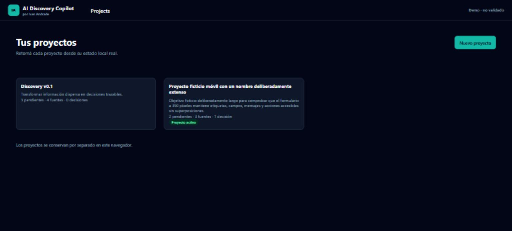
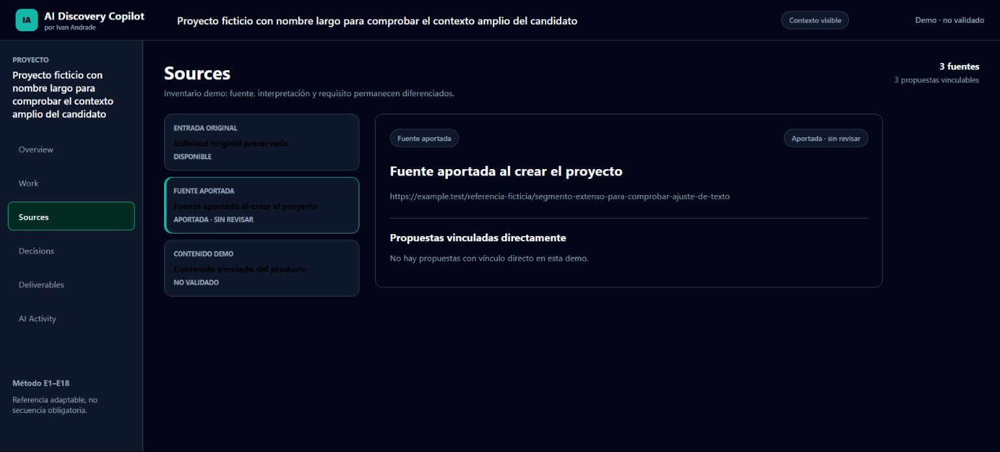
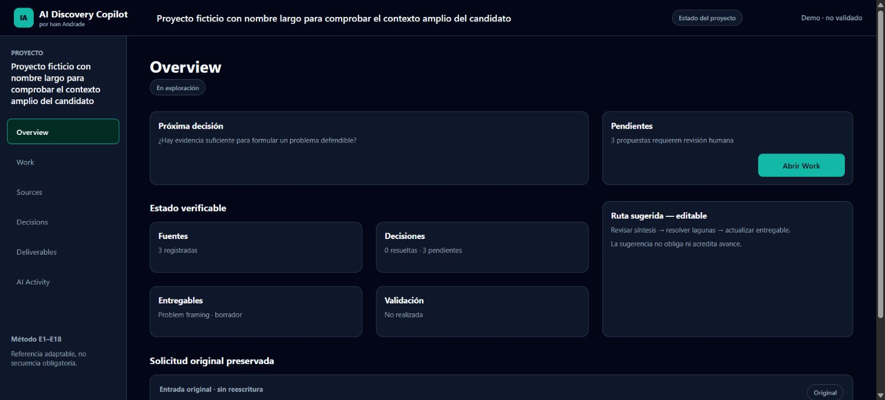

# Trabajo Final Integrador

## AI Product Discovery Copilot

Estado: borrador documental v0.1. No es todavía el PDF final.

## a. Introducción

### Justificación

> “Elegí este tema porque quiero aprender a conducir proyectos de producto de manera más ordenada y, al mismo tiempo, trabajar con mayor agilidad al transformar solicitudes incompletas en decisiones y entregables de diseño.”

La idea surgió mientras revisaba mi propio proceso de UX/UI y Product Design. Todavía no contaba con una forma de trabajo end-to-end consolidada y necesitaba comprender mejor qué información hace falta, qué puede descubrirse durante el proceso y cómo conservar las decisiones tomadas. A esa necesidad de aprendizaje se sumó un feedback recibido durante una experiencia en NoCountry: debía ganar agilidad, especialmente en UI, prototipado y preparación de propuestas.

La solución elegida es **AI Product Discovery Copilot**, una plataforma conceptual que recibe una solicitud de producto, incluso incompleta, y ayuda a organizarla como evidencia, supuestos, preguntas, propuestas y decisiones trazables. La IA funciona como asistencia; la persona conserva el control sobre qué aceptar, editar, rechazar o mantener pendiente.

### Objetivo

El objetivo del trabajo es demostrar, mediante una maqueta HTML navegable, cómo una interfaz asistida por IA podría acompañar una primera parte del proceso de discovery sin reemplazar la fuente original ni presentar inferencias como hechos. El recorrido mínimo implementado es:

**solicitud original → propuesta simulada de IA → revisión humana → decisión → historial → entregable derivado**.

La entrega corresponde al Nivel 2 admitido por la consigna: una maqueta navegable que muestra el funcionamiento potencial aunque no exista todavía un backend o una integración real con un modelo.

## b. Marco conceptual

### IA generativa como asistencia

En este proyecto la IA generativa se entiende como una herramienta capaz de ayudar a ordenar información, formular propuestas, señalar preguntas abiertas y producir borradores. No se la trata como una fuente independiente de evidencia ni como responsable final de una decisión de producto.

### Control humano

El principio rector del producto es: **la IA propone, la persona decide y la evidencia permanece visible**. Aceptar una propuesta no demuestra que haya sido validada con usuarios. Sólo registra que una persona decidió incorporarla al estado vigente de la demo.

### Trazabilidad

La trazabilidad permite reconstruir qué entrada originó una propuesta, qué explicación la acompañó, qué acción tomó la persona y qué versión llegó al entregable. Por eso la aplicación separa Work, Sources, Decisions, Deliverables y AI Activity en lugar de presentar una única respuesta extensa de chat.

### Herramientas

Se utilizaron herramientas de exploración visual y de implementación asistida. Figma y Figma Make se usaron para trabajar estructura y variantes visuales; UXPilot y Abacus.AI aportaron alternativas exploratorias; Codex asistió la construcción de la maqueta React, las pruebas, las correcciones y la documentación. React, Vite, ESLint y Git sostienen la implementación y su verificación, pero no son modelos de IA.

Figma Make y UXPilot no mostraron para Iván un modelo identificable. Abacus.AI se utilizó en su modalidad gratuita, sin que quedara registrado el modelo subyacente. Estas limitaciones se declaran en lugar de atribuir nombres no verificados.

## c. Metodología

### 1. Recuperación y delimitación

El proyecto comenzó recuperando la consigna, las notas existentes y el contexto de una idea inicialmente muy amplia: asistir las etapas E1–E18 del proceso UX/Product de punta a punta. Esa visión incluía investigación, definición, wireframes, prototipos y posibles usos futuros con clientes.

Para evitar construir una plataforma demasiado grande para el TP, se separó una base académica de las extensiones futuras. La base quedó definida como una maqueta navegable con datos ficticios y control humano. Se dejaron fuera autenticación, base de datos remota, multiusuario, leads, CRM, automatizaciones de negocio, integraciones e IA real. La publicación estática anterior se incorporó para facilitar la evaluación, sin convertir la maqueta en una aplicación funcional con backend. El lote local más reciente todavía no fue versionado ni publicado.

### 2. Exploración visual

Se generaron variantes en Figma Make, UXPilot y Abacus.AI a partir de instrucciones extensas. Estas alternativas ayudaron a comparar estructuras y a consolidar en Figma un recorrido con proyectos, overview, workbench, fuentes, decisiones, entregables y actividad.

Las variantes fueron exploratorias. No se interpretaron como validación ni como evidencia de que una estructura funcionaría para usuarios reales.

#### Prompts e intervenciones representativas

El registro completo se conserva en `docs/prompt-log.md`. El ejemplo principal fue el **Prompt maestro de exploración visual v0.1**, que fijó el principio “AI proposes → Human decides → Evidence remains visible”, las pantallas mínimas, los límites de alcance y los estados que debían representarse.

Durante la prueba, Iván también dirigió correcciones mediante intervenciones concretas. Al observar “3 pendientes”, señaló que la tarjeta actual debía seguir contando mientras no tuviera una acción; esto corrigió el contador. Luego preguntó si una decisión aceptada podía volver a editarse; a partir de esa revisión se incorporó la reapertura con conservación del historial y retiro del contenido del entregable. Estas decisiones humanas modificaron el comportamiento propuesto por las herramientas.

### 3. Construcción por porciones verticales

La aplicación se implementó con React y Vite en incrementos verificables:

1. Projects, New Project y Overview.
2. Work y acciones humanas.
3. Decisions e historial.
4. Deliverables, Sources y AI Activity.
5. Revisión responsive y accesibilidad acotada.
6. Corrección del modelo local para conservar múltiples proyectos, validar el almacenamiento y representar fallos y conflictos sin pérdida silenciosa.

Esta estrategia permitió comprobar cada relación antes de ampliar el alcance. Por ejemplo, primero se verificó que una solicitud pudiera conservarse literalmente; después se añadió una propuesta y recién entonces el registro y el entregable derivado.

### 4. Pruebas y ajustes

Las pruebas fueron recorridos manuales internos en navegador. No constituyen pruebas con usuarios. Se verificaron creación, navegación, edición, aceptación, rechazo, mantenimiento en cola, reapertura, sincronización de contadores e inclusión o retiro del entregable.

Durante las pruebas se detectaron y corrigieron problemas concretos:

- el contador debía incluir la tarjeta actual mientras siguiera pendiente;
- una decisión aceptada debía poder reabrirse;
- el historial registraba dos veces una acción debido a un efecto secundario dentro de una actualización de estado de React;
- los rótulos de pendientes y decisiones debían flexionar correctamente en singular y plural; la corrección se verificó con cero, uno y varios;
- los estados seleccionados necesitaban información semántica además del cambio visual.
- el primer despliegue falló porque GitHub Pages todavía no estaba habilitado para GitHub Actions; se corrigió la configuración y el segundo intento completó build y publicación.

La revisión final incluyó `lint`, build de producción, consola del navegador y una inspección responsive a 390 × 844 píxeles.

En el lote multiproyecto se diferenciaron tres clases de comprobación. En navegador local se probaron proyectos independientes, fuentes aportadas, acciones humanas, activaciones repetidas, dos pestañas, responsive amplio y estrecho y un recorrido acotado con teclado. La revisión estática contrastó el esquema y las rutas de error con el código. Un almacenamiento simulado y aislado comprobó preservación de `v0.1`, migración válida única, escritura obsoleta, fallo de guardado, `v0.2` incompatible y recuperación programática del respaldo. Una entrada heredada malformada reveló una brecha; el lote correctivo incorporó validación completa antes de persistir y el retest confirmó que JSON inválido, propuestas malformadas y estructuras incompletas no crean `v0.2`. La auditoría accesible integral, las tecnologías de asistencia y la URL pública no se repitieron.

## d. Resultados

El resultado es una maqueta HTML navegable que permite:

- crear, listar y abrir múltiples proyectos locales sin reemplazar los anteriores;
- conservar la solicitud original sin reescritura;
- revisar tres propuestas ficticias claramente identificadas;
- consultar fuente, evidencia y explicación;
- aceptar, editar, rechazar o mantener pendiente;
- reabrir una decisión;
- consultar el historial sin borrar acciones anteriores;
- construir un borrador sólo con decisiones aceptadas;
- retirar automáticamente un bloque cuando su decisión se reabre;
- distinguir fuentes originales, interpretaciones, marcos y requisitos;
- consultar actividad observable sin afirmar que existe una IA ejecutándose;
- registrar una fuente aportada como “Aportada · sin revisar”, sin atribuirle las propuestas ficticias del proyecto;
- exportar un respaldo y detener escrituras cuando se detectan datos `v0.2` incompatibles o una pestaña desactualizada.

El candidato local corrigió la validación de la migración heredada y los dos rótulos en singular. El retest focalizado y el recorrido multiproyecto resultaron satisfactorios; la versión pública anterior permanece separada.

El código, la documentación y la evolución del proyecto están disponibles en:

https://github.com/Ivan-andrade7/ai-product-discovery-copilot

La versión publicada anterior puede recorrerse sin instalación en:

https://ivan-andrade7.github.io/ai-product-discovery-copilot/

GitHub Pages todavía no contiene el lote multiproyecto descrito aquí. Vercel continúa siendo el alojamiento preferido para la próxima publicación; está preparado, pero el despliegue y su verificación siguen pendientes.

### Evidencia visual seleccionada

Las figuras 1–5 documentan la versión histórica publicada. Las figuras 6–8 corresponden al candidato local no publicado y usan exclusivamente datos ficticios.

**Figura 1.** Overview conserva la entrada original y separa el estado verificable de la ruta sugerida.

**Figura 2.** Work mantiene visible el contexto de la propuesta y registra que la versión fue editada y aceptada.

**Figura 3.** Decisions conserva la aceptación anterior y agrega la reapertura como una nueva acción.

**Figura 4.** Deliverables incorpora únicamente el contenido aceptado y muestra su origen.

**Figura 5.** La vista móvil reorganiza la cola y las acciones en una sola columna.

**Figura 6.** Projects muestra dos proyectos locales independientes y su estado derivado.

**Figura 7.** Sources distingue la fuente aportada y no le atribuye propuestas demo.

**Figura 8.** El contexto amplio conserva jerarquía y legibilidad en el escenario inspeccionado; no constituye una prueba integral de responsive.

La aplicación conserva varios proyectos, sus fuentes, propuestas, decisiones y entregables mediante el formato local `v0.2`. Si encuentra una clave compatible `v0.1`, crea el estado nuevo sin modificar la clave anterior. Una fuente ingresada se mantiene “sin revisar” y las propuestas demo de un proyecto nuevo indican que no derivan de ella.

Los datos `v0.2` incompatibles se preservan para rescate y un fallo de guardado mantiene la copia en memoria exportable. La exportación existe y el respaldo pudo recuperarse programáticamente; todavía no hay importación desde la interfaz. La salida heredada se valida antes de guardar: un `v0.1` malformado queda intacto, muestra recuperación y no crea `v0.2`. Cada navegador mantiene su propia copia y no existe sincronización remota.

Pendiente para la versión final: seleccionar cuáles de estas capturas entrarán en el límite recomendado del informe.

## e. Análisis crítico

### Fortalezas

La principal fortaleza es la separación explícita entre entrada, interpretación y decisión. La solicitud original permanece visible y las propuestas no se presentan como hallazgos de research. El historial permite entender qué cambió y la reapertura evita convertir una decisión en algo irreversible.

La maqueta también mantiene proporcionalidad: representa el recorrido necesario para demostrar la idea sin intentar automatizar todo E1–E18. Esto facilita explicar el aporte de IA y el papel humano con un alcance defendible.

### Limitaciones

Las propuestas están preparadas localmente y no provienen de un modelo conectado. La persistencia sólo existe en el navegador; no hay backend, autenticación, colaboración remota, IA real, protección de datos de clientes ni integración con servicios externos. Tampoco se realizaron entrevistas o pruebas con usuarios, por lo que no puede afirmarse que la solución mejore productividad, comprensión o calidad de las decisiones.

La aplicación detecta cambios observados entre pestañas y bloquea la copia desactualizada, pero `localStorage` no ofrece una transacción entre lectura y escritura. Por eso persiste un riesgo de carrera ante escrituras estrictamente simultáneas y no se afirma protección completa de concurrencia.

La migración conservadora funcionó para el ejemplo válido y rechazó sin escritura los casos malformado, inválido e incompleto probados. Esto no garantiza compatibilidad con cualquier dato heredado imaginable; los originales continúan disponibles para rescate.

La revisión accesible fue una inspección técnica limitada. Se revisaron reflow, jerarquía, foco y estados semánticos, pero no se ejecutó una auditoría WCAG completa ni pruebas con tecnologías de asistencia.

### Evaluación AIBPS

**Ágil.** El recorrido concentra propuesta, contexto y decisión en una misma zona de trabajo, y actualiza automáticamente el historial y el entregable. Esto demuestra una intención de reducir trabajo manual, pero no se midió ahorro de tiempo.

**Fluida.** La navegación mantiene continuidad entre Overview, Work, Decisions y Deliverables. En móvil las columnas se reorganizan y las acciones se apilan. La fluidez observada es técnica e interna; falta validarla con otras personas.

**Protegida.** La demo probada usa datos ficticios, no transmite información a servicios externos y no incorporó datos personales al repositorio. La validación de esquema, la recuperación y el aviso de conflicto reducen pérdidas accidentales en el escenario local probado, pero no demuestran seguridad integral. Una versión futura con clientes necesitaría autenticación, permisos, privacidad, tratamiento de fuentes y políticas de retención.

**Bajo control humano.** Es la dimensión más desarrollada: ninguna propuesta entra al entregable sin aceptar o editar y aceptar; rechazar o mantener pendiente no la incorpora; reabrir la retira; el historial conserva la acción anterior. Aun así, controlar una propuesta no equivale a validarla con evidencia externa.

## f. Conclusiones

El trabajo permitió transformar una visión amplia en un producto demostrable y coherente con el nivel técnico admitido por la consigna. El aprendizaje principal fue que usar IA de manera profesional no consiste sólo en generar más contenido, sino en conservar el origen, explicitar la incertidumbre y diseñar momentos de decisión humana.

También resultó valioso trabajar mediante incrementos pequeños y verificables. Las pruebas revelaron errores que no eran visibles en el diseño estático, como la duplicación del historial y la relación entre reapertura y entregable. Esto mostró la diferencia entre imaginar un flujo y comprobar su comportamiento.

Como evolución futura, la prioridad recomendada es incorporar una operación real y acotada de IA manteniendo la misma trazabilidad. La captación de leads, el portal de clientes y las integraciones deberían considerarse después, cuando el flujo central esté probado y existan reglas de privacidad y permisos.

## Pendientes para convertir este borrador en entrega

1. Revisar contenido, selección de capturas y extensión antes de retirar la marca de borrador.
2. Reconfirmar la fecha contra cualquier aviso docente posterior.
3. Registrar el modelo exacto de Codex si puede recuperarse; de lo contrario, mantener la limitación declarada.
4. Decidir si se versiona el candidato local que superó el retest correctivo. Un push a `main` activa actualmente GitHub Pages, por lo que también requerirá autorización de publicación.
5. Desplegar en Vercel sólo con autorización y verificar que la publicación corresponda al commit elegido.
